# 🗂️ Sơ Đồ Cấu Trúc Project

## Sơ Đồ Cây Thư Mục

```
ktlt_project/
│
├── 📄 main.py
├── 📄 README.md
├── 📄 guide.txt
│
├── 📁 app/
│   ├── 📄 __init__.py
│   │
│   ├── 📁 core/
│   │   ├── 📄 __init__.py
│   │   ├── 📄 linked_list.py
│   │   └── 📄 constants.py
│   │
│   ├── 📁 models/
│   │   ├── 📄 __init__.py
│   │   ├── 📄 student.py
│   │   ├── 📄 schedule.py
│   │   ├── 📄 attendance.py
│   │   ├── 📄 session.py
│   │   └── 📄 school_class.py
│   │
│   ├── 📁 services/
│   │   ├── 📄 __init__.py
│   │   ├── 📄 file_manager.py
│   │   ├── 📄 report_service.py
│   │   └── 📄 attendance_manager.py
│   │
│   └── 📁 ui/
│       ├── 📄 __init__.py
│       └── 📄 menu.py
│
├── 📁 tests/
│   ├── 📄 __init__.py
│   ├── 📄 test_linked_list.py
│   ├── 📄 test_models.py
│   ├── 📄 test_services.py
│   └── 📄 test_persistence.py
│
└── 📁 data/
    ├── 📄 classes.txt
    ├── 📄 students.txt
    ├── 📄 schedules.txt
    ├── 📄 sessions.txt
    └── 📄 attendance.txt
```

---

## Sơ Đồ Mermaid

```mermaid
graph TD
    ROOT["📁 ktlt_project/"]

    ROOT --> MAIN["📄 main.py<br/><i>Entry point</i>"]
    ROOT --> README["📄 README.md"]
    ROOT --> GUIDE["📄 guide.md"]

    ROOT --> APP["📁 app/"]
    ROOT --> TESTS["📁 tests/"]
    ROOT --> DATA["📁 data/"]

    APP --> CORE["📁 core/"]
    APP --> MODELS["📁 models/"]
    APP --> SERVICES["📁 services/"]
    APP --> UI["📁 ui/"]

    CORE --> LL["📄 linked_list.py<br/><i>MyLinkedList, Node</i>"]
    CORE --> CONST["📄 constants.py<br/><i>AttendanceStatus</i>"]

    MODELS --> ST["📄 student.py<br/><i>Student</i>"]
    MODELS --> SCH["📄 schedule.py<br/><i>Schedule</i>"]
    MODELS --> ATT["📄 attendance.py<br/><i>AttendanceRecord</i>"]
    MODELS --> SESS["📄 session.py<br/><i>Session</i>"]
    MODELS --> SC["📄 school_class.py<br/><i>SchoolClass</i>"]

    SERVICES --> FM["📄 file_manager.py<br/><i>FileManager</i>"]
    SERVICES --> RS["📄 report_service.py<br/><i>AttendanceReport<br/>AbsenceReportItem</i>"]
    SERVICES --> AM["📄 attendance_manager.py<br/><i>AttendanceManager</i>"]

    UI --> MENU["📄 menu.py<br/><i>MainProgram</i>"]

    TESTS --> TLL["📄 test_linked_list.py"]
    TESTS --> TM["📄 test_models.py"]
    TESTS --> TS["📄 test_services.py"]
    TESTS --> TP["📄 test_persistence.py"]

    DATA --> D1["📄 classes.txt"]
    DATA --> D2["📄 students.txt"]
    DATA --> D3["📄 schedules.txt"]
    DATA --> D4["📄 sessions.txt"]
    DATA --> D5["📄 attendance.txt"]
```



---

## Mô Tả Nhanh Từng Thành Phần

| Thư mục / File | Mô tả |
|----------------|-------|
| `main.py` | Entry point — khởi động `MainProgram` |
| `app/core/linked_list.py` | Cấu trúc dữ liệu tự cài: `Node` + `MyLinkedList` |
| `app/core/constants.py` | Hằng số `AttendanceStatus` (PRESENT / EXCUSED / UNEXCUSED) |
| `app/models/student.py` | Thông tin học sinh |
| `app/models/schedule.py` | Thời khóa biểu (thứ, tiết, phòng) |
| `app/models/attendance.py` | Bản ghi điểm danh của một học sinh trong một buổi |
| `app/models/session.py` | Một buổi học cụ thể (lớp + ngày) |
| `app/models/school_class.py` | Lớp học, chứa danh sách học sinh / lịch / buổi học |
| `app/services/file_manager.py` | Đọc và ghi file văn bản thuần |
| `app/services/report_service.py` | Báo cáo thống kê, xếp hạng vắng, cảnh báo >20% |
| `app/services/attendance_manager.py` | Facade: điều phối toàn bộ hệ thống, lưu/tải dữ liệu |
| `app/ui/menu.py` | Giao diện menu CLI (12 chức năng) |
| `tests/` | Test suite tách theo từng layer |
| `data/` | File lưu trữ dữ liệu dạng text (pipe-delimited) |
